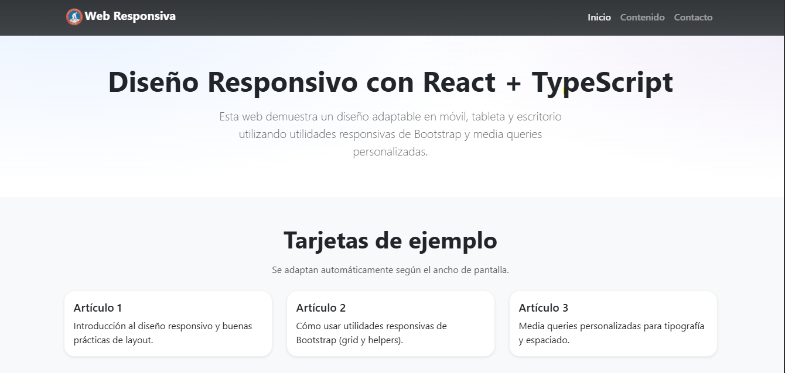
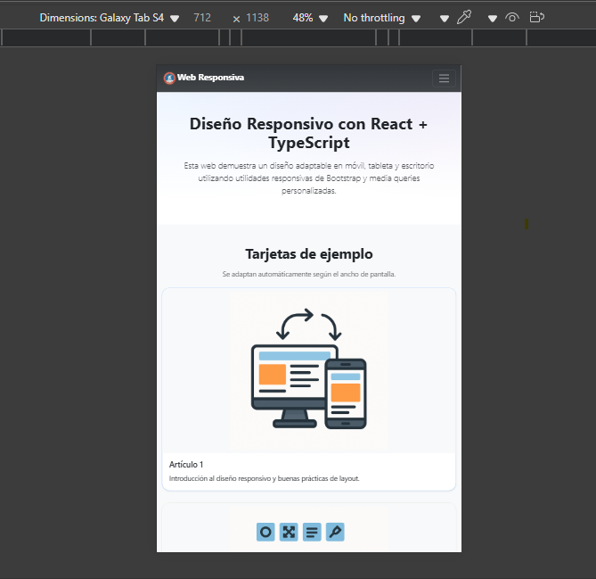
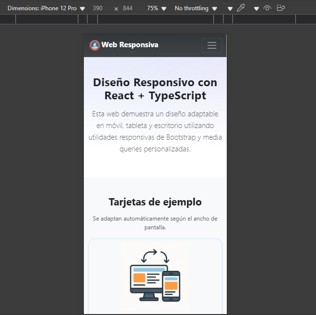

# 🌐 Web Responsiva

Aplicación web desarrollada con **React + TypeScript** y **Bootstrap**, diseñada para adaptarse automáticamente a diferentes tamaños de pantalla (móvil, tableta y escritorio) mediante **utilidades responsivas** y **media queries personalizadas**.

## 📋 Características

- **Encabezado (Header)** con logo y menú de navegación responsivo (menú hamburguesa en móvil).
- **Sección principal (Main)** con título y descripción.
- **Sección de tarjetas (Section)** con layout adaptable:
  - 1 columna en móvil (≤600px)
  - 2 columnas en tableta (601px–1024px)
  - 3 columnas en escritorio (>1024px)
- **Pie de página (Footer)** con enlaces a redes sociales.
- Diseño mejorado con tipografía, colores y efectos `hover`.
- Documentación de **media queries** dentro del CSS, explicando su función en cada breakpoint.

---

## 🛠️ Tecnologías utilizadas

- [React](https://react.dev/) + [TypeScript](https://www.typescriptlang.org/)
- [Vite](https://vitejs.dev/) (entorno de desarrollo rápido)
- [Bootstrap 5](https://getbootstrap.com/) + [React Bootstrap](https://react-bootstrap.github.io/) (componentes y utilidades responsivas)
- CSS personalizado con media queries documentadas

---
## 📱 Vista previa

### 🖥️ Escritorio


### 📟 Tableta


### 📱 Móvil



---

## 📦 Instalación y ejecución local

1. **Clonar el repositorio**
   ```bash
   git clone https://github.com/BJCorado/Web-Responsiva.git

2. **Entrar a la carpeta del proyecto**
```bash
   cd Web-Responsiva
```
3. **Instalar dependencias**
```bash
   npm install
```
4. **Iniciar el servidor en desarrollo**
```bash
   npm run dev
```
El proyecto estará disponible en:
http://localhost:5173
